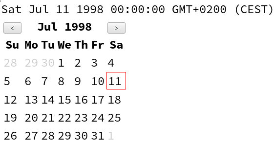

# cyclejs-calendar

> Calendar component for Cycle.js

## [Demo live](http://enten.github.io/cyclejs-calendar/example/)

[](http://enten.github.io/cyclejs-calendar/example/)

## Usage

```javascript
import Cycle from '@cycle/core';
import {div, makeDOMDriver} from '@cycle/dom';
import {Observable} from 'rx';
import Calendar from 'cyclejs-calendar';

function main({DOM}) {
  const calendarProps$ = Observable.of({
    year: 1998, month: 6
  });

  const calendar = Calendar({DOM, props$: calendarProps$});

  return {
    DOM: Observable.combineLatest(calendar.DOM, calendar.value$,
      (calendarVTree, value) => {
        return div([
          div(value ? value.toString() : 'Pick a date'),
          calendarVTree
        ]);
      })
  };
}

Cycle.run(main, {
  DOM: makeDOMDriver('#main-container')
});
```
